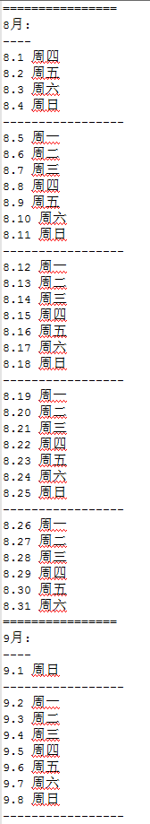

# TodoListTools（TodoList辅助工具）

---

Automated generation of date lists with weekly paragraphs.

这是一个为todo list提供的辅助工具，按照年月日和星期，以每周为小段落，以每月为大段落，自动生成日程日历文本，方便填写。

示例：

---

### 使用方法

执行build_gulp.bat文件即可

打开build_gulp.bat文件可以看到执行内容（其中2019是年份，5是月份）

gulp publish --year=2019 --month=5 --filename=out5.txt

---

### 主要模块

Node.js、gulp